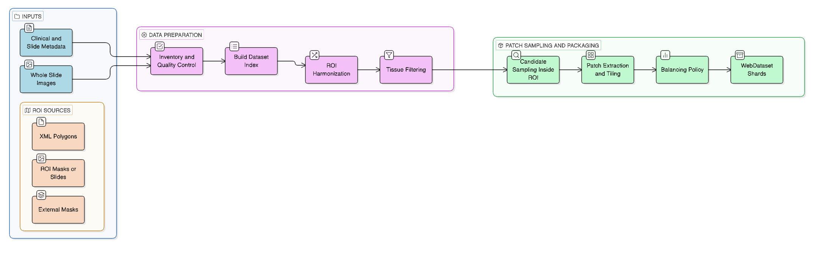

# Self-Supervised Learning for Renal Cell Carcinoma Subtyping


This repository hosts a comprehensive computational pathology pipeline for Renal Cell Carcinoma (RCC) subtyping. The project addresses the challenge of medical annotation scarcity (label scarcity) by leveraging **Self-Supervised Learning (SSL)** techniques to learn robust morphological representations from unlabeled data, benchmarked against **Supervised Baselines** trained on labeled patches.

**Paper (Draft)**  
Draft manuscript: `paper.tex` (root).

---

## 🔬 Project Workflow

The project is structured as a sequential pipeline. During data preparation, we support **multiple ROI sources** for tumor region identification. In the experiments reported in the paper, ccRCC/pRCC rely on **expert XML annotations**, while CHROMO/ONCO use **ROI slides / provided ROI masks**. The pipeline also supports ingesting **pre-computed binary masks** (e.g., from an external segmentation model) when available.


### 1. Data Engineering (ETL)

Management of Whole-Slide Images (WSI). Slides are scanned, inventoried, and associated with anonymized clinical metadata.

### 2. ROI Extraction & WebDataset

This phase converts slides into training-ready datasets. ROI handling supports multiple input sources:

* **Scenario A (Vector Coordinates / XML):** XML annotations (e.g., ASAP/QuPath) are parsed and converted into ROI masks for patch sampling .
* **Scenario B (ROI Slides / Provided ROI Masks):** ROI slides or provided binary ROI masks are ingested directly .
* **Optional (External Pre-computed Masks):** If masks from an external segmentation model are available, they can be used as an alternative ROI source.

Tissue is subdivided into 224×224 patches (20× equivalent, 0.50 mpp target resolution) and saved in **WebDataset format (sharded .tar)**. Patch-level evaluation includes an auxiliary **NOT_TUMOR** class, while patient-level metrics are computed with **tumor-only aggregation** (NOT_TUMOR excluded).

**Preprocessing Pipeline Diagram:**



**Patch Settings:**
- Patch size: 224 px
- Target resolution: 0.50 µm/px (≈20×)
- Minimum tissue ratio: 0.10

Settings are sourced from `rcc-ssrl/src/data_processing/config.yaml`.

### 3. Training Strategies

The framework supports multiple training modalities configurable via **YAML** files:

#### A. Self-Supervised Learning (SSL)

We train a **ViT-S/16** (`vit_small_patch16_224`) backbone without using diagnostic labels to learn tissue morphology.

* **Methods:** MoCo v3, DINO v3, iBOT, I-JEPA.
* **Objective:** Create a robust and generalizable feature extractor.
* **Implementation:** Backbones defined in `rcc-ssrl/src/training/trainer/backbones.py`.

#### B. Supervised Learning (Baseline)

We train **ResNet-50** architectures in classical supervised manner, utilizing diagnostic labels (ccRCC, pRCC, CHROMO, ONCO) with Cross-Entropy Loss.

* **Supervised (Scratch):** Training from random initialization (`rcc-ssrl/src/training/models/supervised.py`).
* **Transfer Learning:** Fine-tuning from ImageNet pre-trained weights (`rcc-ssrl/src/training/models/transfer.py`).
* **Purpose:**  Provide a **strong supervised reference baseline** for comparison against SSL under the same preprocessing and splits.

### 4. Downstream & Explainability

* **Evaluation:** Comparison between Linear Probe (on frozen SSL features) and supervised models at both patch-level and patient-level.
* **Orchestrator:** A custom engine manages the lifecycle of training, validation, checkpointing, and logging across paradigms.
* **XAI Pipeline:** Latent semantic analysis via PLIP concept scoring and spatial interpretability via attention rollout maps.

---

## 📊 Dataset Overview

The dataset comprises histological whole-slide images from RCC patients, with the following distribution:

* **Total WSIs:** 196 slides from 88 patients
* **Subtype Distribution:**
  - ccRCC: 124 slides
  - pRCC: 48 slides
  - ONCO: 13 slides
  - CHROMO: 11 slides
* **Patches:** ~168k H&E patches used in the benchmark 
* **Patch Labels:** Includes `NOT_TUMOR` class for patch-level evaluation

Counts are sourced from `rcc-ssrl/src/data_preprocessing/reports/02_parquet/slides.csv`

⚠️ **Dataset Note:** The original dataset is proprietary (owned by Politecnico di Torino). However, the pipeline is data-agnostic and can be adapted to other histological datasets.

---

## 📂 Repository Structure

The code is organized modularly in `src/`:

```text
rcc-ssrl/src/
├── data_preprocessing/          # PHASE 1: Data and Metadata Ingestion
│   ├── 00_wsi-drive-analysis/   # Scripts for filesystem scanning and WSI inventory
│   ├── 01_rcc_metadata/         # Clinical/pathological metadata enrichment
│   │   └── rcc_metadata_enrich.py
│   └── 02_parquet/              # Tabular dataset index creation (slides.parquet)
│       └── parquet_build.py
│
├── data_processing/             # PHASE 2: Image Manipulation and WebDataset
│   ├── roi_index_and_masks_v3.py       # Dual-Input logic (XML parser & Mask loader)
│   ├── generate_candidates.py          # Valid patch coordinate identification
│   ├── balance_and_select.py           # Class balancing (sampling)
│   └── build_webdataset_balanced.py    # Physical dataset creation (.tar)
│
├── training/                    # PHASE 3: Training Loop
│   ├── configs/                 # Hierarchical configurations (Experiment, Model, Data)
│   │   └── ablations/           # SSL and supervised experiment configs
│   ├── models/                  # SSL and SL architectures (MoCo, DINO, iBOT, I-JEPA, Supervised, Transfer)
│   ├── loss/                    # Loss functions (InfoNCE, KoLeo, iBOT Patch Loss, etc.)
│   ├── trainer/                 # Lightning modules, Backbones, and Projection Heads
│   │   └── backbones.py         # ViT-S/16 implementation
│   ├── orchestrator.py          # Manages training, validation, and checkpoint loops
│   └── launch_training.py       # Main entry point for training
│
├── evaluation/                  # PHASE 4: Validation and Metrics
│   ├── eval.py                  # Script for Linear Probing and Test Set evaluation
│   ├── configs/                 # Evaluation configuration files
│   └── tools/                   # Calibration metrics, risk-coverage, patient aggregation, and result tables
│       ├── batch_patient_aggregation.py
│       ├── calibration_and_coverage.py
│       └── auto_eval.py
│
└──explainability/              # PHASE 5: Explainable AI
   ├── spatial/                 # Attention Rollout map generation
   ├── concept/                 # PLIP Concept Scoring and semantic analysis
   └── run_xai_pipeline.sh      # XAI automation script

```

---

## 🚀 Reproducibility Guide

### 0. Computational Resources and Execution Environment

Experiments were conducted on the Politecnico di Torino HPC infrastructure, managed via Slurm Workload Manager. The following sections detail the hardware specifications and runtime configurations used for model training (SSL and Baseline):

#### 0.1 Hardware Configuration

* **GPU Accelerators**: Nodes equipped with NVIDIA A40 (48 GB VRAM).
  * Job configuration: 1 GPU per experiment (default configuration), with scalability via `torchrun`.
  * Slurm partition: `gpu_a40`.

* **Processors (CPU)**: 8 cores/vCPUs assigned per task (`--cpus-per-task=8`) to ensure optimal throughput for data loading via WebDataset.

* **System Memory (RAM)**: 64 GB allocated per node (`--mem=64G`) to handle batch caching and dataloader overhead.

#### 0.2 Runtime Configuration

* **Time limit**: Jobs are configured with a wall-clock time limit of 24 hours (`-t 24:00:00`), sufficient for SSL model convergence (MoCo v3, DINO v3) on histological datasets of the considered size.

* **Distributed training framework**: Training utilizes `torchrun` in DDP (Distributed Data Parallel) mode, automatically managing inter-GPU communication even in single-node configurations (`--standalone`).

---

### 1. Installation

```bash
git clone https://github.com/Blackhand01/RCC-SSL.git
cd RCC-SSL
conda create -n rcc-ssl python=3.9
conda activate rcc-ssl

# Install dependencies for all pipeline stages
pip install -r rcc-ssrl/src/training/requirements.txt
pip install -r rcc-ssrl/src/data_preprocessing/01_rcc_metadata/requirements.txt
pip install -r rcc-ssrl/src/data_preprocessing/02_parquet/requirements.txt
pip install -r rcc-ssrl/src/evaluation/requirements_eval.txt
```

---

### 2. Data Preparation (Flexible)

The pipeline requires defining tumor Regions of Interest (ROI). The preprocessing workflow is structured in sequential steps:

#### 2.1 Prepare Metadata

Create a `metadata.csv` for your WSIs with the following required columns:
- `subtype`: RCC subtype label (ccRCC, pRCC, CHROMO, ONCO)
- `patient_id`: Anonymous patient identifier
- `wsi_filename`: Filename of the whole-slide image
- `annotation_xml`: Path to XML annotation file (if using Scenario A)
- `num_annotations`: Number of annotations
- `roi_files`: Path to pre-computed ROI masks (if using Scenario B)
- `num_rois`: Number of ROI masks
- `source_dir`: Directory containing the WSI

See `rcc-ssrl/src/data_preprocessing/01_rcc_metadata/README.md` for detailed specifications.

#### 2.2 Enrich Metadata and Build Index

```bash
# Enrich metadata with file system information
python rcc-ssrl/src/data_preprocessing/01_rcc_metadata/rcc_metadata_enrich.py \
  --raw-dir <RAW_WSI_ROOT> \
  --report-dir <REPORT_DIR> \
  --metadata-csv <METADATA_CSV>

# Build slides.parquet index
python rcc-ssrl/src/data_preprocessing/02_parquet/parquet_build.py \
  --metadata <REPORT_DIR>/rcc_metadata.csv \
  --inventory <REPORT_DIR>/wsi_inventory.csv \
  --output-dir <REPORT_DIR>/02_parquet \
  --csv-also
```

#### 2.3 Configure Processing Pipeline

Edit `rcc-ssrl/src/data_processing/config.yaml` with your paths and data splits:

```yaml
paths:
  out_masks: /path/to/masks
  out_candidates: /path/to/candidates
  out_balanced: /path/to/balanced
  out_webdataset: /path/to/rcc_webdataset_final

split:
  folds_json: /path/to/folds.json
```

#### 2.4 Generate ROI Masks and WebDataset Shards

Execute the preprocessing pipeline sequentially:

```bash
# Step 1: Generate ROI masks from XML annotations or load pre-computed masks
python rcc-ssrl/src/data_processing/roi_index_and_masks_v3.py \
  --config rcc-ssrl/src/data_processing/config.yaml

# Step 2: Generate candidate patch coordinates
python rcc-ssrl/src/data_processing/generate_candidates.py \
  --config rcc-ssrl/src/data_processing/config.yaml \
  --source both

# Step 3: Balance class distribution
python rcc-ssrl/src/data_processing/balance_and_select.py \
  --config rcc-ssrl/src/data_processing/config.yaml

# Step 4: Create WebDataset shards (.tar files)
python rcc-ssrl/src/data_processing/build_webdataset_balanced.py \
  --config rcc-ssrl/src/data_processing/config.yaml
```

---

### 3. Training Experiments

Training is configured via **YAML** files. Set the dataset root environment variable and launch experiments using the `launch_training.py` script.

```bash
export RCC_DATASET_ROOT=/path/to/rcc_webdataset_final
```

#### 3.1 Self-Supervised Learning (SSL)

Train SSL models with different paradigms:

```bash
# MoCo v3
python rcc-ssrl/src/training/launch_training.py \
  --config rcc-ssrl/src/training/configs/ablations/moco_v3/exp_moco_v3_abl03.yaml

# DINO v3
python rcc-ssrl/src/training/launch_training.py \
  --config rcc-ssrl/src/training/configs/ablations/dino_v3/exp_dino_v3_abl03.yaml

# iBOT
python rcc-ssrl/src/training/launch_training.py \
  --config rcc-ssrl/src/training/configs/ablations/ibot/exp_ibot_abl04.yaml

# I-JEPA
python rcc-ssrl/src/training/launch_training.py \
  --config rcc-ssrl/src/training/configs/ablations/i_jepa/exp_i_jepa_abl03.yaml
```

#### 3.2 Supervised Baselines

Train supervised models from scratch and with ImageNet initialization:

```bash
# Supervised (ResNet-50 from scratch)
python rcc-ssrl/src/training/launch_training.py \
  --config rcc-ssrl/src/training/configs/ablations/supervised/exp_supervised.yaml

# Transfer Learning (ResNet-50 ImageNet pre-trained)
python rcc-ssrl/src/training/launch_training.py \
  --config rcc-ssrl/src/training/configs/ablations/transfer/exp_transfer.yaml
```

*The `orchestrator.py` module automatically detects the training mode (SSL or Supervised) from the configuration file and adapts the training loop accordingly (loss function, metrics, logging).*

---

### 4. Evaluation and Patient-Level Aggregation

#### 4.1 Linear Probing (SSL Models)

For SSL models, assess feature quality via linear probing on frozen representations:

```bash
python rcc-ssrl/src/evaluation/eval.py \
  --config <EVAL_CONFIG_YAML>
```

**Note:** Evaluation configuration YAMLs in `rcc-ssrl/src/evaluation/configs/` contain absolute paths and must be adapted to your environment. Alternatively, generate new configurations automatically:

```bash
python rcc-ssrl/src/evaluation/tools/auto_eval.py
```

#### 4.2 Patient-Level Aggregation

Aggregate patch-level predictions to patient-level diagnosis using probability summation:

```bash
python rcc-ssrl/src/evaluation/tools/batch_patient_aggregation.py \
  --mlruns-root <MLRUNS_ROOT> \
  --method prob_sum
```

**Important:** Patch-level metrics include the `NOT_TUMOR` class. Patient-level metrics are tumor-only and exclude `NOT_TUMOR` as defined in the aggregation script.

---

### 5. Explainability (XAI Pipeline)

Generate interpretability analyses including attention rollout maps and PLIP concept scoring:

```bash
bash rcc-ssrl/src/explainability/run_xai_pipeline.sh
```

This pipeline produces:
- **Spatial Analysis:** Attention rollout visualizations showing model focus regions
- **Concept Analysis:** PLIP-based semantic concept scoring in the latent space

---

## 📊 Main Results

The following results are sourced from `rcc-ssrl/src/evaluation/results/models_results_compare_table/main_results_best.csv`.

⚠️ **Patient-level note:** tumor-only patient-level evaluation on the held-out test split is computed on **Npat(T)=12** tumor patients and should be interpreted with caution

**Performance Metrics:**

| Model | Patch Macro-F1 | Patient Macro-F1 | Patient Accuracy |
|-------|---------------|------------------|------------------|
| **MoCo v3 (SSL)** | **0.736** | **0.945** | **0.917** |
| DINO v3 (SSL) | 0.615 | 0.786 | 0.750 |
| iBOT (SSL) | 0.529 | 0.612 | 0.833 |
| I-JEPA (SSL) | 0.464 | 0.354 | 0.417 |
| Supervised (ResNet-50 scratch) | 0.819 | 0.881 | 0.833 |
| Transfer (ResNet-50 ImageNet) | 0.857 | 0.880 | 0.833 |

**Key Findings:**

- **MoCo v3** achieves the best patient-level performance (0.945 Macro-F1) among SSL methods, demonstrating exceptional ability to learn discriminative low-level features (texture/color) crucial for histological analysis.

- **Supervised baseline** establishes the upper bound at patch level (0.819 Macro-F1) but requires pixel-level annotations (100% labels), with significant annotation cost.

- **DINO v3** produces highly coherent attention maps with strong semantic focus, but global features are less discriminative for linear classification compared to MoCo v3.

- **iBOT** exhibits training instability on medium-sized datasets and requires complex hyperparameter tuning for the masked image modeling (MIM) + distillation approach.

- **I-JEPA** shows slow convergence as the predictive approach in latent space struggles to model the high variance of tumor textures.

- **Transfer Learning** from ImageNet provides moderate performance, indicating limited domain transfer from natural images to histological tissue.

---

## 🤝 Citation

If you use this code or results in your research work, please cite the paper:


S. Bisignano, M. Di Maggio, "Self-Supervised Learning for Renal Cell Carcinoma Subtyping on Whole-Slide Images," in Polytechnic of Turin project, 2026.


---

## ⚖️ Medical Disclaimer

**For research purposes only.** This software is not a medical device. It is not approved for clinical diagnosis or therapeutic decisions. Models are provided "as is" to promote research in computational pathology.